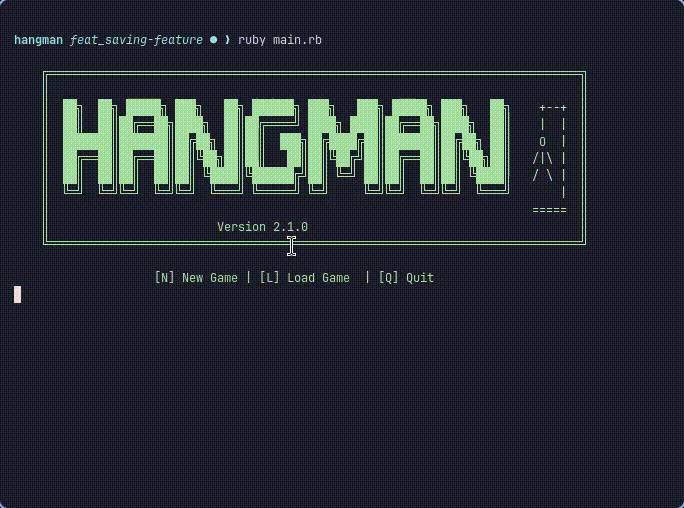

# Hangman


## Description

A command-line Hangman game built as part of [The Odin Project](https://www.theodinproject.com/) Ruby curriculum. The computer randomly selects a secret word from a dictionary of 10,000 common English words, and the player has 6 lives to guess it letter by letter before being hanged.

---

## Table of Contents

- [Gameplay](#gameplay)
- [Features](#features)
- [How It Works](#how-it-works)
- [Save System](#save-system)
- [Installation](#installation)
- [Usage](#usage)
- [What I Learned](#what-i-learned)

---

## Gameplay



---

## Features

- Dictionary of 10,000 common English words (5–12 characters)
- ASCII art hangman that builds progressively with each wrong guess
- Colorized lives display (♥ / ♡) using terminal colors
- In-game UI panel showing lives, wrong letters, and available commands
- Save and resume a game at any point using JSON serialization
- Already-guessed letter detection
- Play again prompt after win or loss
- Quit at any time with `!`

---

## How It Works

1. On launch, choose to start a new game, load a saved game, or quit
2. The computer picks a random word between 5 and 12 characters
3. The word is displayed as underscores — one per letter
4. Each turn, the player guesses a letter:
   - Correct → letter is revealed in its position(s)
   - Wrong → a body part is added to the hangman, a life is lost
5. The game ends when the player guesses the word or runs out of lives

---

## Save System

At any point during the game, type `$` to save your progress. The game state is serialized to JSON and written to `saves/savefile.json`:

```json
{
  "secret": "programming",
  "right_letters": ["p", "r", "g"],
  "wrong_letters": ["x", "z"],
  "guessed": 2
}
```

On the next launch, choose `[L] Load Game` to resume exactly where you left off — same word, same guesses, same lives remaining.

---

## Installation

1. Clone the repository:
```bash
git clone https://github.com/doug-bill/hangman.git
```

2. Navigate into the project:
```bash
cd hangman
```

3. Install dependencies:
```bash
bundle install
```

4. Run the game:
```bash
ruby main.rb
```

### Dependencies

```ruby
gem 'colorize'  # colored lives display
```

---

## Usage

| Input | Action |
|---|---|
| Any letter | Guess that letter |
| `$` | Save the current game |
| `!` | Quit the game |
| `N` | New game (on launch) |
| `L` | Load saved game (on launch) |
| `Q` | Quit (on launch) |

---

## What I Learned

- How to read and filter large text files with `File.open` and `select`
- How to serialize and deserialize game state using JSON (`JSON.generate` / `JSON.parse`)
- How `File.write` and `File.read` work for persistent storage
- How to design a save/load system using keyword arguments (`load: true`) in `initialize`
- Building a reusable game UI with heredoc (`<<~UI`) for clean multi-line output
- Using ANSI escape codes to clear the screen and redraw the UI between turns
- Separating game logic into focused methods (`process_guess`, `display_hangedman`, `game_ui`)

---

## Project

This project is part of the [Ruby Programming path](https://www.theodinproject.com/paths/full-stack-ruby-on-rails/courses/ruby) on The Odin Project.

---

Built by [Douglas Franco](https://github.com/doug-bill) | The Odin Project — Ruby Full Stack